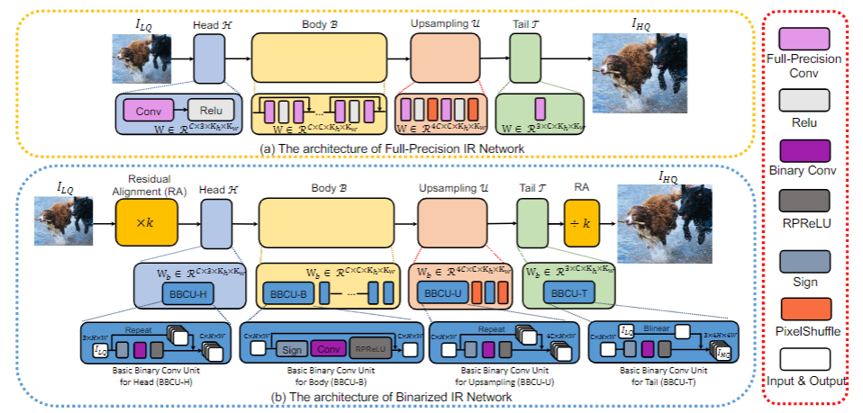

# Basic Binary Convolution Unit for Binarized Image Restoration Network （ICLR2023）


 [Paper](https://arxiv.org/pdf/2210.00405.pdf) | [Project](https://github.com/Zj-BinXia/BBCU) | [pretrained models](https://drive.google.com/drive/folders/1MRZejm6JqnQKRXnLCxZmryRCatWnk31g?usp=sharing)

<hr />


> **Abstract:** *Lighter and faster image restoration (IR) models are crucial for the deployment on resource-limited devices. Binary neural network (BNN), one of the most promising model compression methods, can dramatically reduce the computations and parameters of full-precision convolutional neural networks (CNN). However, there are different properties between BNN and full-precision CNN, and we can hardly use the experience of designing CNN to develop BNN. In this study, we reconsider components in binary convolution, such as residual connection, BatchNorm, activation function, and structure, for IR tasks. We conduct systematic analyses to explain each component's role in binary convolution and discuss the pitfalls. Specifically, we find that residual connection can reduce the information loss caused by binarization; BatchNorm can solve the value range gap between residual connection and binary convolution; The position of the activation function dramatically affects the performance of BNN. Based on our findings and analyses, we design a simple yet efficient basic binary convolution unit (BBCU). Furthermore, we divide IR networks into four parts and specially design variants of BBCU for each part to explore the benefit of binarizing these parts. We conduct experiments on different IR tasks, and our BBCU significantly outperforms other BNNs and lightweight models, which shows that BBCU can serve as a basic unit for binarized IR networks.*

<p align="center">
  
</p>

---

##  Dependencies and Installation

- Python >= 3.8 (Recommend to use [Anaconda](https://www.anaconda.com/download/#linux) or [Miniconda](https://docs.conda.io/en/latest/miniconda.html))
- [PyTorch >= 1.10](https://pytorch.org/)


### Installation

1. Clone repo

    ```bash
    git clone git@github.com:Zj-BinXia/BBCU.git
    ```

2. If you want to train or test BBCU for super-resolution

    ```bash
    cd BBCU-SR
    ```
    
3. If you want to train or test BBCU for denoising and deblocking

    ```bash
    cd BBCU-denoiseAndblocking
    ```
**It is notable that our amplification factor k for residual alignment is used to balance the value range gap of full-precision residual branch and binarized Conv branch as input image range is 0-1. The best k∗ is related to the number of feature channels n, which empirically fits k∗ = 130n/64. You can adjust it according to your network setting.**

**More details please see the README in folder of BBCU-SR and BBCU-denoiseAndblocking** 

---
## BibTeX

    @article{xia2022basic,
      title={Basic Binary Convolution Unit for Binarized Image Restoration Network},
      author={Xia, Bin and Zhang, Yulun and Wang, Yitong and Tian, Yapeng and Yang, Wenming and Timofte, Radu and Van Gool, Luc},
      journal={ICLR},
      year={2023}
    }

## 📧 Contact

If you have any question, please email `zjbinxia@gmail.com`.
